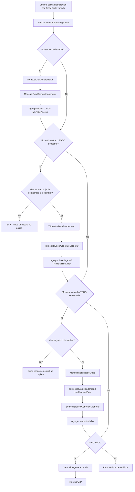

# Documentación de lógica de generación de informes AIOS

## 1. Propósito del programa

Este proyecto genera boletines AIOS en Excel para tres periodicidades: **mensual**, **trimestral** y **semestral**. El usuario entrega una fecha de corte y un modo de generación; el servicio central valida la periodicidad, lee los insumos de Excel requeridos, calcula indicadores, escribe los valores sobre plantillas de salida y, cuando se solicita el modo `TODO`, empaqueta los archivos generados en un ZIP.

## 2. Componentes principales

| Componente | Responsabilidad |
|---|---|
| `AiosGeneracionService` | Orquesta el flujo de generación según el modo: mensual, trimestral, semestral o todo. Valida meses trimestrales y semestrales, captura errores de memoria y crea ZIP en modo `TODO`. |
| `MensualDataReader` | Lee los insumos base mensuales y arma el record `MensualData`: afiliados, aportantes, traspasos, TRM, límites, rentabilidades, PEA, deuda, pensionados, fondos, activos y pasivos. |
| `MensualExcelGenerator` | Escribe el boletín mensual sobre `Boletin_AIOS MENSUAL.xlsx`, hoja `HOJA1`, en la fila que coincide con la etiqueta de fecha. |
| `TrimestralDataReader` | Lee y calcula los mapas por administradora/fondo requeridos para el boletín trimestral: afiliados, aportantes, traspasos, Colombia USD, gastos USD, comisiones y rentabilidades. |
| `TrimestralExcelGenerator` | Escribe los mapas trimestrales en las hojas de la plantilla trimestral: `afiliados`, `aportantes`, `colombia`, `traspasos`, `gastos`, `promotores`, `rentabilidad` y `comisiones`. |
| `SemestralExcelGenerator` | Genera `semestral.xlsx` con indicadores agregados de afiliados, pensionados, límites, deuda, contabilidad, comisiones y rentabilidades. También registra trazas por fila con explicación y valores usados. |
| `RentabilidadService` | Calcula rentabilidades nominales y reales para horizontes de 1, 3, 5 y 10 años con series de NAV e IPC. |
| `InsumosLocator` | Localiza archivos de insumo por texto y fecha de corte, explorando carpetas esperadas por tipo de archivo. |

## 3. Insumos usados

| Insumo | Uso principal | Hojas/celdas destacadas |
|---|---|---|
| `Serie_Formato_ 491 AFILIADOS AFP.xlsm` | Afiliados, aportantes, género, edades, salario mínimo y datos de multifondos. | `informe de prensa`: `C11`, `D11`, `C81:D84`; `multifondos`: `E25`, `J8:J12`; `SM COLOMBIA`: `E8`. |
| `Serie_Formato_493 MOVIMIENTO AFILIADOS.xlsx` | Traspasos del sistema. | `Traslados Entre AFP`, celda `BQ11` y rangos equivalentes para mapas trimestrales. |
| `SISTEMA TOTAL` | Fondos administrados, composición y participación de entidades. | Hoja `restot`: `J14`, `C14`, `D14` y otros valores por administradora/fondo. |
| `LIMITES` | Límites de inversión locales y del exterior. | Hoja `AIOS`: `AB4`, `C4`, `E4`, `G4`, `I4`, `K4`, `O4`, `Q4`, `S4`, `U4`, `W4`, `Y4`, `AA4`. |
| `PIB_PEA_TRM_DG` | PEA, PIB semestral, TRM y deuda gubernamental. | Hoja `Hoja1`: fecha en columna `L`, deuda gubernamental en columna `M`, además de series de TRM/PEA/PIB usadas por los lectores. |
| `Series_Formato-495 PENSIONADOS.xlsm` | Total y composición de pensionados. | Hoja `TOTAL PENSIONADOS`, parámetro `B4`, serie en columna `I`; hoja `por Entidad`, parámetro `C6`, celdas `BI62`, `BH62`, `BJ62`. |
| `Formato_136_Meses.xlsm` | Aportes recibidos para indicadores semestrales. | Hoja `FORMATO OBL`: parámetros `C7`, `D6`, `D7`; resultado `G6`. |
| `Plantilla AIOS-probable.xlsm` | Datos contables de cuentas, activos/pasivos, patrimonio y resultados. | Hoja `CUENTAS`: `C4`, `C6`, `C15`, `C21`, `C22`, `C24`, `C28`, `C29`, `C31:C38`, `E13`, `G15`, `E41`, `E44`, `H24`. |
| `Rent_Vr_Uni_Moderado.xlsm` | IPC y rentabilidad real/nominal cuando aplica fallback. | Hojas o series de IPC/rentabilidad moderada. |
| `Valores_Fondo_Moder` / `MODERADO` | NAV histórico para rentabilidades semestrales. | Series de valor de unidad/NAV por fecha. |

## 4. Flujo general del programa



### Flujo equivalente en texto

1. Recibir `fechaCorte` y `modo`.
2. Si el modo incluye mensual, leer `MensualData` y escribir el boletín mensual.
3. Si el modo incluye trimestral, validar que el mes sea marzo, junio, septiembre o diciembre; leer `TrimestralData` y escribir el boletín trimestral.
4. Si el modo incluye semestral, validar que el mes sea junio o diciembre; leer `MensualData`, leer `TrimestralData` con soporte de datos mensuales y escribir el boletín semestral.
5. Si el modo es `TODO`, crear un ZIP con todos los archivos generados.

## 5. Lógica del informe mensual

El informe mensual usa `MensualDataReader` para leer los insumos base y `MensualExcelGenerator` para escribir una fila de la hoja `HOJA1` de la plantilla mensual. La fila destino se identifica buscando en la columna `A` la etiqueta textual de fecha producida por el lector.

El boletín mensual combina:

- **Valores crudos**: afiliados, aportantes, traspasos y TRM.
- **Valores monetarios en USD**: fondos administrados y total de límites se dividen por TRM.
- **Porcentajes**: límites y rentabilidades se multiplican por 100 antes de escribirse.
- **Constantes**: la columna mensual asociada al número fijo `4` no depende de insumos externos.

## 6. Lógica del informe trimestral

El informe trimestral genera una nueva fila, o reutiliza una existente, en cada hoja de la plantilla trimestral. Cada hoja contiene un conjunto de columnas por administradora o fondo. Los datos se transportan en mapas (`Map<String, BigDecimal>`) con claves como `colf`, `porv`, `prot`, `sk`, `mod_colf`, `con_porv`, `mr_sk`, etc.

Hojas escritas:

| Hoja | Tipo de dato | Unidad general |
|---|---|---|
| `afiliados` | Afiliados por administradora y fondo. | Valor crudo de personas. |
| `aportantes` | Aportantes por administradora. | Valor crudo de personas. |
| `colombia` | Fondos o saldos de Colombia por administradora/fondo. | USD o millones de USD según plantilla de referencia. |
| `traspasos` | Traspasos por administradora. | Valor crudo de personas/transacciones. |
| `gastos` | Gastos netos por administradora. | USD, calculado desde COP y dividido por TRM. |
| `promotores` | Datos de promotores. | Valor crudo; actualmente se escriben ceros cuando no hay fuente. |
| `rentabilidad` | Rentabilidad nominal y real. | Porcentaje. |
| `comisiones` | Comisiones obligatorias por administradora. | Porcentaje. |

## 7. Lógica del informe semestral

El informe semestral escribe filas específicas de una plantilla semestral. La columna destino se determina por la fecha de corte. La lógica agrupa los datos en bloques:

1. **Afiliados, edades, aportantes, PEA y salario mínimo**: provienen principalmente de Formato 491 y PIB/PEA/TRM.
2. **Pensionados**: usa Formato 495 para totales y composición por invalidez, vejez y sobrevivencia.
3. **Fondos, PIB y deuda**: combina `SISTEMA TOTAL`, TRM, PIB y deuda gubernamental total de `PIB_PEA_TRM_DG`.
4. **Límites de inversión**: usa `LIMITES`, hoja `AIOS`.
5. **Contabilidad y gastos**: usa `Plantilla AIOS-probable.xlsm`, hoja `CUENTAS`, y `Formato_136_Meses.xlsm` para aportes recibidos.
6. **Comisiones y aportes**: combina comisiones trimestrales con constantes regulatorias.
7. **Rentabilidades**: usa `RentabilidadService` sobre NAV e IPC para horizontes de 1, 3, 5 y 10 años.

### Parámetros especiales de Formato 136

Para hallar `aportesRecibidos136`, antes de evaluar `G6` en la hoja `FORMATO OBL` se escriben los siguientes parámetros:

| Celda | Valor |
|---|---|
| `C7` | Primer día del mismo mes, un año antes de `fechaCorte`. Ejemplo: para `30/06/2025`, se escribe `01/06/2024`. |
| `D6` | `fechaCorte`. |
| `D7` | `fechaCorte`. |


## 8. Lectura conceptual de los datos

Además de indicar la celda exacta de origen, la documentación de fórmulas incluye una lectura conceptual de cada fila semestral. Esta lectura separa tres niveles:

1. **Dato técnico**: archivo, hoja, celda y operación usada para obtener el valor.
2. **Concepto económico o operativo**: qué representa el dato dentro del sistema pensional.
3. **Interpretación**: para qué sirve el indicador y qué pregunta ayuda a responder.

Por ejemplo, la fila 29 no se documenta solo como `fila28 / PIB`, sino como el indicador **Fondos administrados / PIB (%)**, que mide el tamaño relativo del sistema de fondos de pensiones frente a la economía. De forma similar, la fila 31 se documenta como **Deuda gubernamental local (%)**, que mide la exposición del portafolio a deuda pública interna.

Las fórmulas conceptuales se escriben con notación matemática en Markdown, por ejemplo:

$$
\text{Fondos / PIB (\%)} = \frac{\text{Valor total de los fondos de pensiones}}{\text{Producto Interno Bruto (PIB)}} \times 100
$$

$$
\text{Deuda gubernamental local (\%)} = \frac{\text{Valor invertido en deuda gubernamental local}}{\text{Valor total del portafolio de fondos}} \times 100
$$

## 9. Manejo de unidades

| Unidad | Convención usada |
|---|---|
| COP | Valores leídos directamente de cuentas o series contables antes de dividir por TRM. |
| USD / millones USD | Valores resultantes de dividir montos COP por TRM; en algunos casos se divide además por `1,000,000` para expresar millones. |
| Porcentaje | El valor se escribe como ratio con formato de porcentaje o se multiplica por 100 según la convención de la fila/plantilla. |
| Valor crudo | Conteos de afiliados, aportantes, traspasos, pensionados o constantes. |

## 10. Trazabilidad

La generación semestral emite un log por fila con el formato:

```text
Semestral fila número XX: Explicación="..." valor=... fechaCorte=... columnaDestino=...
```

Cada explicación describe las variables que intervienen, el archivo y hoja de origen, las celdas usadas, los operandos y la unidad esperada. Algunas filas con lecturas especiales agregan detalles de fuente, fallback o celdas exactas.
